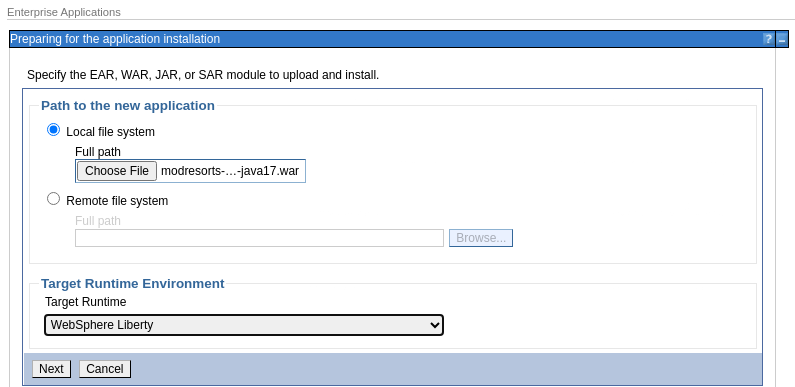
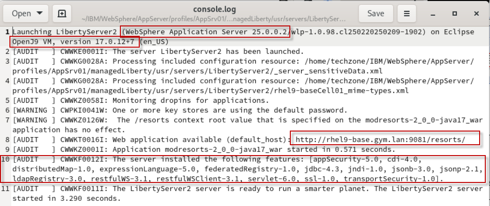

**Modernized Runtime Extension (MoRE) Lab guide**

**PREREQUISITES:**

Before running this demo, you must have completed the demo setup documentation: [Setup environment](./setup.md)

**INTRODUCTION:**

MoRE provides the capability to continue using traditional WebSphere Application Server (tWAS) Operational Model to manage Java 17 and Java 8 applications within the same traditional WebSphere administrative environment


In this lab, you will seew how to extend a WebSphere ND Cell, using the MoRE feature pak, for managed Liberty servers to manage and run Java 17 / Jakarta EE 10 (subset) applications using the familiar WebSphere administrative mode and admin console.

The demo first shows an example application "Mod Resorts" running in WebSphere ND 9.0.23. The application is a simple Java 8 application using JEE 7 APIs.

Included with the demo, is a new version of the Mod Reports application that is built using Java 17 and Jakarta 10 EE APIs, which are supported in the managed Liberty Servers (MoRE).

At the end of this demo, you should be able to showcase how to:

- View the installed WebSphere / MoRE components in IBM Installation Manager

- Create a new managed Liberty server (MoRE) using the WAS admin console

- Install the new Java 17 version of the example application and target the managed Liberty server using the WAS admin console

- Start the managed Liberty server using the WAS admin console

- Locate and view the managed Liberty server logs

- From the web browser, run the new example application running Java 17 in a WebSphere cell.

1.  View the installed WebSphere / MoRE components in IBM Installation Manager.

<!-- -->

a.  Open a new **terminal** window and Launch **IBM Installation Manager**

```
/home/techzone/IBM/InstallationManager_Group/eclipse/IBMIM
```

b.  Click the **Uninstall** option. DO NOT UNINSTALL ANY COMPONENTS!

c.  Review the installed components


Alternatively, you could use the command imcl listInstalledPackages instead:

(Use the option -long to get additional information)

```
/home/techzone/IBM/InstallationManager_Group/eclipse/tools/imcl listInstalledPackages -long
```

2.  Start if needed the WebSphere Application Server, view the installed applications

<!-- -->

a.  Check the status of your application server environment and if necessary, start it

Deployment manager

To check the status:

```
/home/techzone/IBM/WebSphere/AppServer/profiles/Dmgr01/bin/serverStatus.sh -all
```

To start the Dmgr:

```
/home/techzone/IBM/WebSphere/AppServer/profiles/Dmgr01/bin/startManager.sh
```

Node agent

To check the status: 
```
/home/techzone/IBM/WebSphere/AppServer/profiles/AppSrv01/bin/serverStatus.sh -all
```

To start the Node agent:

```
/home/techzone/IBM/WebSphere/AppServer/profiles/AppSrv01/bin/startNode.sh
```

b.  Launch the **Chrome** browser in the demo environment

c.  Navigate to the **WebSphere Admin Console**, and login, if not already logged in.

```
https://localhost:9043/ibm/console
```
>
> User ID: techzone
>
> Password: IBMDem0s!

d.  Navigate to **Server Types \> WebSphere application servers**

e.  Start **server1** that is running on traditional WebSphere 9.0.0.5.23

> The server1 is now in the "**started**" state

f.  Navigate to **Applications \> All applications**

> The Mod Resorts Java 8 application should be **running**


3.  Run the original version of Mod Resorts application

<!-- -->

a.  Open a new browser tab in **Chrome** browser in the demo environment

b.  Navigate to the original Mod Resorts application running on WebSphere Application Server ([http://localhost:9080/resorts/)](http://localhost:9080/resorts/))

<!-- -->

4.  Enable the command assistant so that you can see the wsadmin commands related to the steps done in the console.

    a.  Navigate to **System administration \> Console Preferences.**
        Select the preferences **Enable command assistant notification** and **Log command assistance commands**, then click on **Apply**.

> 

5.  Create a new Managed Liberty Server using the WebSphere Admin Console.

<!-- -->

a.  From the WAS Admin Console, navigate to **Servers \> Server Types \> WebSphere application Servers**

b.  Click the **New...** Button
 
c.  Select **Managed Liberty server** from the drop-down menu


> Complete the steps in the "**Create a new application server**" dialog to create the managed Liberty Server

d.  **Step 1:** Select a node and specify managed Liberty server name (Node must be running 9.0.5.23 or higher)

- Select node: **rhel9-baseNode01 (ND 9.0.5.23)**

- Server name: **LibertyServer2**

e.  **Step 2:** Select a server template

- Accept the default Managed Liberty server template

f.  **Step 3:** Specify properties

- Ensure **Generate Unique Ports** is **checked** (to avoid port conflicts with WAS servers on the same machine)

g.  **Step 4:** confirm new server

- Click **Finish** to create the new managed Liberty Server

**\**

h.  As you enabled command assistance notification, you can see the related wsadmin command. Click on **View administrative scripting command for last action**.\
    \
    

i.  The wsadmin command to create a Liberty server is shown in a pop-up window.\
    \
    \
    \
    Finally close the pop-up window.

j.  **Save** the changes to synchronize the master configuration\
    \
    

k.  When the configuration synchronization is complete, click the **OK** button\
    \
    

l.  The new managed Liberty server is now created, and in the "**stopped**" state


6.  Install a modernized version of mod resorts application (java 17 / Jakarta EE 10) to the managed Liberty server

    a.  From WAS Admin console, navigate to **Applications \> New Application**

    b.  Click the **New Enterprise Application** link and complete the steps in the **install application dialog**

    c.  [Path to the new application]:

    - Click the **Choose** **File** button and navigate to the modernized Mod Resorts WAR file on the local demo environment.

> **HOME \> techzone \> demos \> ManagedLiberty-MoRE \> modresorts-2.0.0-java17.war**

- Then click the **Select** button on the **Open File** dialog.

d.  [Target Runtime Environment]

- Select **WebSphere Liberty** from the list of Target Runtimes\
      \
    \
      \
    Then click the **Next** button

e.  [How do you want to install the application]

- Select the **Fast Path** radio button as the installation options.

- Then click the **Next** button

f.  [Step 1: Select installation options]

- Accept the default values and click the **Next** button

  a.  [Step 2: Map modules to servers]

- **Check** the box next to the modresorts-2.0.0 module

- Ensure the **LibertyServer2** (or name of your managed Liberty server) is the target server

- Click the **Apply** button

- Click **Next** to continue

> 

a.  [Step 3: map Context roots for web modules]

- **Accept** the default context root of "**/resorts**" for the web module

- Click **Next** to continue

  a.  [Step 4: Summary]

    - On the summary page, click on **View administrative scripting command for last action**.\
        \
        

    - The wsadmin command to install an application to the Liberty server is shown.

> 

- Close the pop-up window, then click the **Finish** button to install the mod resorts application to the managed Liberty server

- Click the **Save** link to synchronize the changes to the master configuration.

- Click the **OK** button one the configuration is synchronized

7.  Start the new managed Liberty **server** from the WAS admin console

    a.  Navigate to **Servers \> All servers**

    b.  Select the managed Liberty server "**LibertyServer2**" from the server list and click the **Start** button.

> The managed Liberty Server should now be running
>
> 

8.  View the console log of the managed Liberty server

> The managed Liberty server configuration and logs are in the following directory structure:
>
> /home/techzone/IBM/WebSphere/AppServer/profiles/AppSrv01/managedLiberty/usr/servers

a.  Use the **gedit** editor on the dem environment to view the console log.

> gedit /home/techzone/IBM/WebSphere/AppServer/profiles/AppSrv01/managedLiberty/usr/servers/LibertyServer2/logs/console.log

b.  Note the following in the log:

- The managed Liberty server is running Liberty 25.0.0.2

- The managed liberty server is running Java 17

- Note the features that were installed on the managed Liberty server

- The URL for the mod resorts application is: <http://rhel9-base.gym.lan:9081/resorts>



9.  Run the modernized Mod Resorts application on the new managed Liberty Server

    a.  Open a new tab in the **Chrome** browser on the demo environment

    b.  Go to URL: <http://rhel9-base.gym.lan:9081/resorts>


10. Summary

In this demo, we learned how java 17 applications can be deployed and managed via managed Liberty severs in an existing WebSphere Application Server -- ND cell.

In this scenario, we used the very familiar WebSphere Administrative console to create the new managed Liberty server, install Java 17 applications to the server, start the server, view the console log, and run the modernized example application in the same WebSphere cell where other Java 8 applications are also running.

Now some extended stuff:

**Part 1: Change some settings in the managed Liberty**

1.  Open a terminal window and use tail to monitor the Liberty logs.

> tail -f /home/techzone/IBM/WebSphere/AppServer/profiles/AppSrv01/managedLiberty/usr/servers/LibertyServer2/logs/messages.logote the following in the log:

2.  Switch back to the browser and open the All servers view in the administration console

    a.  Navigate to **Servers \> All servers**

    b.  Click on the managed Liberty server "**LibertyServer2**" from the server list.\

    

    c.  Your panel should look like this:\
    

    d.  Click on **Ports**

    e.  Click on **Port Name** to change the sorting. Now you shozkld see the WC_defaulthost close the top. As you can see the port is shown as 9081. Click on **WC_defaulthost**.**\
        \**
    

    f.  Change the port from 9081 to 9082.\
        \
        

    g.  Click on **Apply**.

    h.  Take a look at the command assistant command.\
        \
        

    i.  Close the window and click **Save** to save the changes.

    j.  Switch to the terminal window and you should see that Liberty is now listening on port 9082.\
        \
        

    k.  The application is now accessible at port 9082.\
        

<!-- -->

11. Create a web server definition to explain the load balancing

    a.  Click on **Servers \> Server Types \> Web servers** to open the Web servers panel.\
        Then click **New** to create a new web server definition.\
        \
        

    b.  In Step 1, enter **webserver1 f**or the Server name and leave the default setting for the rest, then click on **Next**.\
        

    c.  For Step 2 and 3, leave the default setting and click **Next**.

    d.  In Step 4, review the settings, then click **Finish**.\
        \
        

    e.  Click **Save** to save the changes.\
        \
        

    f.  Click **OK** to return to the web server panel. Then click on **webserver1** to see the settings.\
        \
        

    g.  Click on Plug-in properties to see the details.\
        \
        

    h.  On the Plug-in properties page, click on **View** to open the plugin configuration file.\
        \
        

    i.  The plugin configuration contains next to the routing information for the WAS traditional server1 also the routing information for the Liberty server.\
        

    j.  By adding the Liberty port 9082 to virtual hosts and installing an HTTP Server with the updated plug-in, the created Liberty instance becomes part of the load balancing without any additional effort like plug-in merge or so.

Optional lab:

**Use Application Modernization Accelerator to analyze applications**

**Step 1: Install Application Modernization Accelerator.**

1.  Open a terminal window in the VM.

2.  Download and extract the Application Accelerator package

```
mkdir \~/ama42

cd \~/ama42

wget https://public.dhe.ibm.com/ibmdl/export/pub/software/websphere/ta/application-modernization-accelerator-local-4.2.0.zip

unzip application-modernization-accelerator-local-4.2.0.zip

cd application-modernization-accelerator-local-4.2.0/
```

3.  Execute the following command to start the installation

```
./launch.sh
```

In the wizard, perform the following steps:

- Enter **1** for 1) IBM Application Modernization Accelerator 4.2 (Evaluation)

- Enter **1** to accept license agreement

- Enter **1** to install AMA

Finally you should see something like

> **Application Modernization Accelerator 4.2.0 is available for use\
> at the following URL\> https://rhel9-base.gym.lan:443**

4.  Access AMA from a browser via URL https://rhel9-base.gym.lan:443.

**Step 2: Create a workspace with sample content**

In AMA, click von **Create workspace** to create a workspace.


Enter as workspace name **samples** and select to include **sample data**, then click **Create**.


Once the workspace has been created and the sample data has been imported and analyzed, you should get a visualization view.

**Step 3: Analyze the applications**


Connection groups help to see which applications are connected to each other.

Open the menu on the left and select **Connected_Group_A**.


You can see that two applications are connected to each other via queue.

This insight might help you if you want to move one of the applications including messaging system into the cloud or into containers.

Switch back to the overall view by clicking on **Applications**.


Now let's take a look at the modresorts application.

Type **mod** into the search bar to find the modresorts application


As you can see, the application has a dependency on a database and a queue.

Click on **Assessment** to see the efforts to migrate to Liberty or MoRE.

Then close the tree with the connected groups.


Select **Liberty administered from WebSphere (MoRE)** to see the assessment for target MoRE.


Scroll down to see the applications that could be migrated to MoRE.

To filter, enter **modr** into the search bar.


As you can see, the sample collection contains two modresorts applications.

Hover over the one in grey and you will get the information that the plication has not been assessed for MoRE.

![](./media/media/image44.png

This means that the data collection was created with an older version of the ta collector tool.

Click on the modresorts application that has been assessed for target MoRE.


On the application details page, scroll down to the section with unique code sues.


As you can see, there is some manual effort is to migrate the application to karta EE 10. The changes to migrate from Java 8 to Java 17 can be automated.

Click on **View migration plan** to see the migration plan.


On the Migration plan page, ou can see that a server.xml file has been created. is will help the developer to test the application locally in his development vironment based on Liberty before deplying it to MoRE.

Click on **server.xml** to open the file.


Cleanup:

Click on **Home** to switch back to the main screen.


**This concludes the lab.**

Optional lab:

**Use Application Modernization Accelerator to create a data collection.**

**Step 1: Create a workspace without sample content**

In AMA, click von **Create workspace** to create a workspace.


Enter as workspace name **wasnd** but do not select include **sample data**, en click **Create**.\

**\**

**Step 2: Download the data collector**

Click on **Open Discovery Tool**


Keep the OS to Linux and select to download the discovery tool.


Make sure that **Downloads** is selected as target and click on **Save**.


**Step 3: Extract the data collector**

1.  Open a terminal window in the VM.

2.  Download and extract the Application Accelerator package

```mkdir \~/ama42collector
cd \~/ama42collector
tar -zxf \~/Downloads/transformationadvisor-Linux_wasnd.tgz
cd transformationadvisor-4.2.0/
```

3.  Execute the following command to see the options.

```
bin/transformationadvisor \--help collection.
```
Press **1** to accept the license agreement.

4.  Execute the following command to create the collection.

```
bin/transformationadvisor -w /home/techzone/IBM/WebSphere/AppServerlection.
```

A panel will open to show that one profile and 2 applications have been found. Wait until the analysis has been done.

Finally you will get a message that the data collection was generated and uploaded.


**Step 4: View the collection in AMA**

Switch back to the browser window with AMA.

In the wasnd workspace, you should find the visualization of the two plications DefaultApplication and modresorts.


Switch to **Assessment** to see the assessment results.


Select **Liberty administered from WebSphere (MoRE)** to see the assessment for rget MoRE.


Scroll down to see for each application the efforts by modernization target.


Feel free to investigate further into the applications.

**This concludes the lab.**
