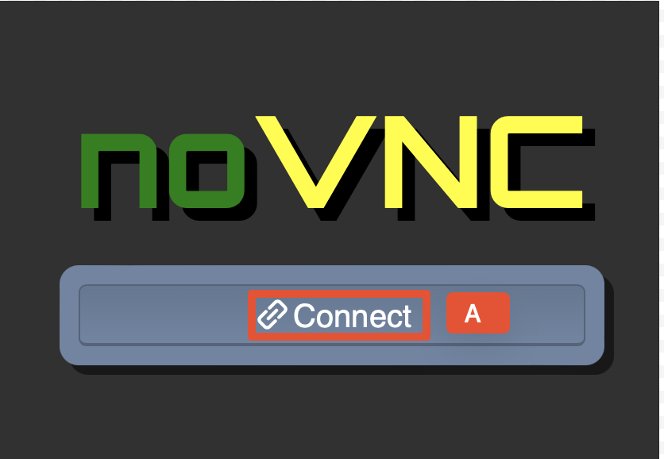
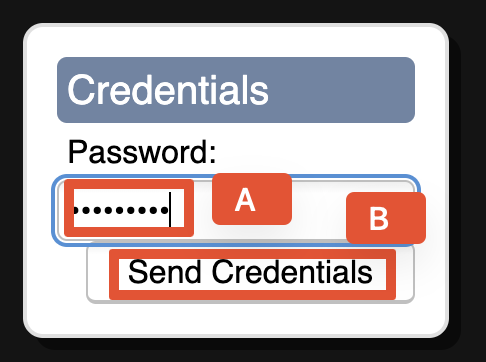
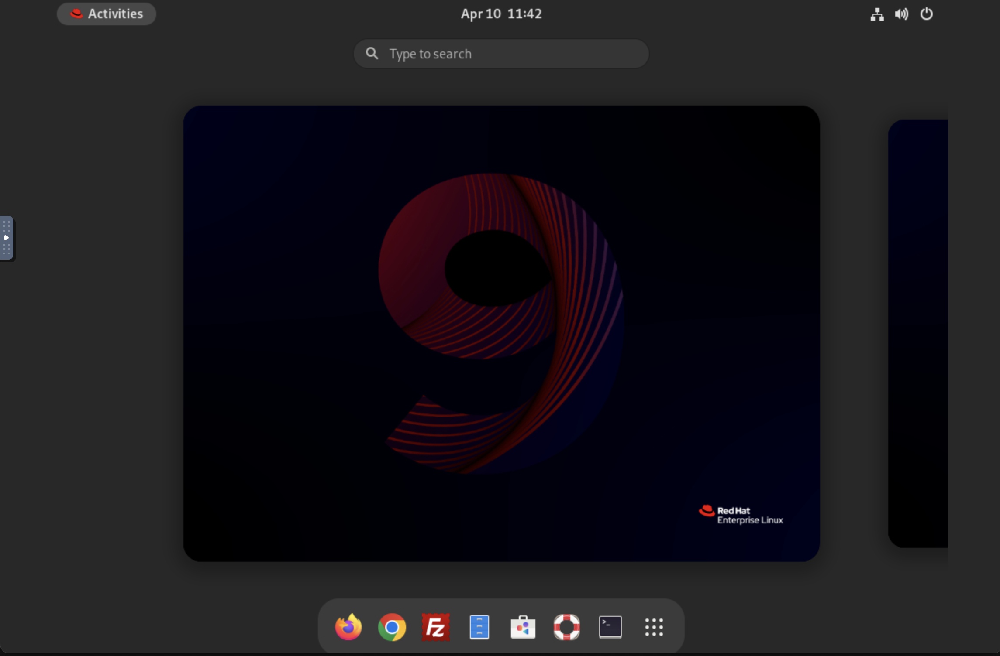
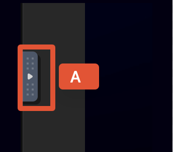
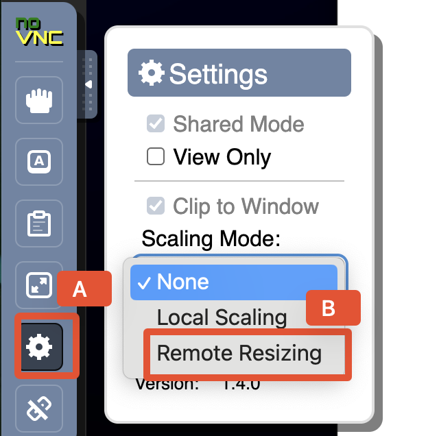
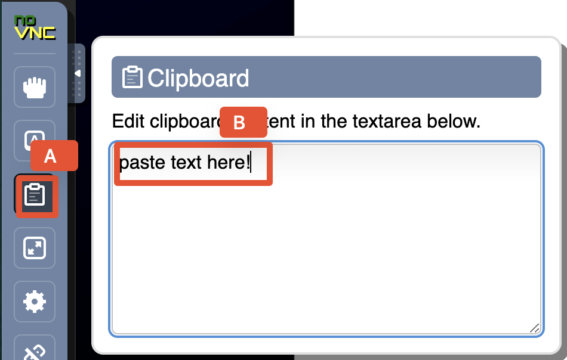
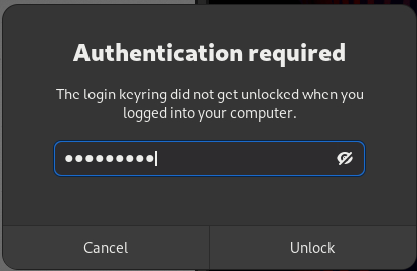

**Modernized Runtime Extension (MoRE) Demo setup guide**

This demo script walks through the prerequisite steps to setup demo environment for the MoRE demo.

MoRE provides the capability to continue using traditional WebSphere Application Server (tWAS) Operational Model to manage Java 17 and Java 8 applications within the same traditional WebSphere administrative environment

1.  Click the **Connect** button (A).

> 

2.  Enter the password as: **IBMDem0s!** (A). Then click the **Send Credentials** button (B) to access the lab environment.

> **Note**: That is a numeric zero in IBMDem0s!



Once you log in to the Demo VM, you will see the Desktop, which contains all the programs that you will be using (browsers, terminal, etc.)

> The login credentials for the **student** VM are:
>
> - User ID: **techzone**
>
> - Password: **IBMDem0s!**
>



3.  Tips for working in the Demo environment

<!-- -->

a.  You can resize the viewable area using the **noVNC Settings** options to resize the virtual desktop to fit your screen.

From the Demo VM, click the **twisty** on the noVNC control pane (A) to open the menu. 



To increase the visible area, click the **Settings** icon (A) and select **Remote Resizing** from the **Scaling Mode** (B).



b.  You can copy / paste text from the Demo guide into the Demo environment using the clipboard in the noVNC viewer. 

    a.  Copy the text from the Demo guide that you want to paste into the Demo environment.

    b.  Click the **Clipboard** icon (A) and **paste** the text into the noVNC clipboard (B).



c.  Paste the text into the VM, such as to a terminal window, browser window, etc. 

d.  Click on the **clipboard** icon again to close the clipboard

<!-- -->

4.  Start the WebSphere environment

  - Start the deployment manager:

```
/home/techzone/IBM/WebSphere/AppServer/bin/startManager.sh
```

  - Start the node agent:

```
/home/techzone/IBM/WebSphere/AppServer/profiles/AppSrv01/bin/startNode.sh
```

c.  Login to the WebSphere Admin Console

- Launch Chrome Browser in the demo environment

- Go to: <https://localhost:9043/ibm/console>

- Enter credentials as:

  - Use ID: techzone

  - Password: IBMDem0s!

**Note:** If you open the browser, you might get a pop-up that Authentication is required.

In that case enter **IBMDem0s!** and click on **Unlock**.



**Start AMA in the demo environment**

1.  Change to the directory where AM is installed

```
cd /home/techzone/ama/ta_local_dev/build/distributions/application-modernization-accelerator-local-4.1.0
```

2.  Launch AMA

```
 ./launch.sh
```

3.  Select option **#5** to START AMA

4.  From the Web Browser on the VM, open AMA using the URL below:

```
http://localhost:3000
```

The demo environment setup is complete.

**\<END OF DOCUMENT\>**
